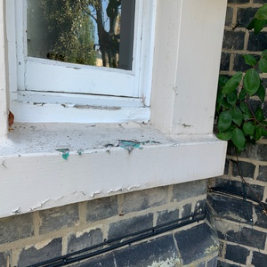
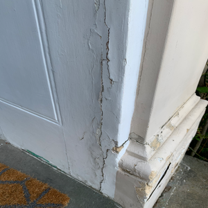
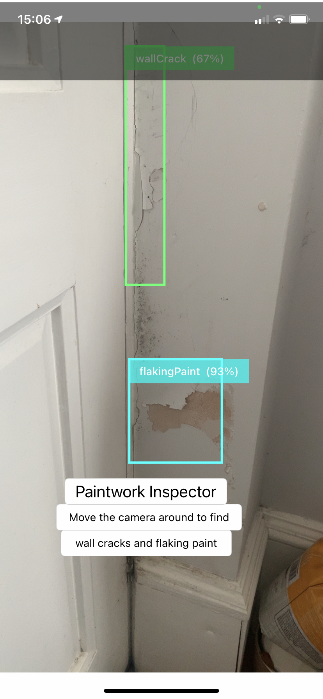
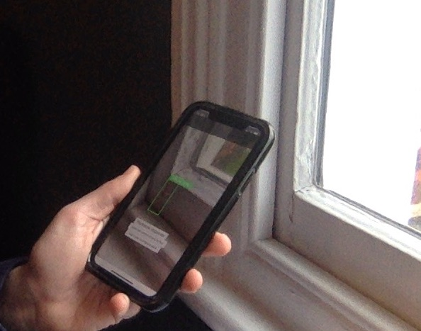

# iOS APP for Housing damage detection.

A mobile app that uses ssd mobilenet model trained in Tensorflow Objection Detection API to detect cracks and peeling paint in houses.

## Training data 

The model used was a ssd_mobilenet_v3 pre-trained on COCO dataset.  Fine-tuning was then done on a bespoke dataset of images taken around my house and crawled from google image search.  For example:

 

 

Each image was labelled using labelimg free annotation software:

https://github.com/tzutalin/labelImg

then the xml files were converted into csv format and finally made into TFrecords.

The image processing is in the processImages.ipynb Jupyter notebook.

## Training the model

The fine-tuning of the model was performed using tensorflow Object Detection API and monitored on Tensorboard.  Once validation performance plateaued (as measured by mAP) the model was saved and then quanitised using TFlite.

The model is InspectorDetect.tflite

## The App

The iOS app is bootstrapped from the tensorflow deeplearning.ai example. Chnages were made to the modelinference funtion and the layout of the app.  It was tested on a iphone x in a live walk around.

 

 

## Usage

1. either use the processimages and model training Jupyter notebooks (Mobile_copy_of_Training_Object_Detection_with_TensorFlow_in_Colab.ipynb) to train and create your own model or:
2. if you have a model of your own already trained place it in the Models folder and change the model in ModelDataHandler.swift:

```swift
enum MobileNetSSD {
  static let modelInfo: FileInfo = (name: "InspectorDetect", extension: "tflite")
  static let labelsInfo: FileInfo = (name: "labelmap", extension: "txt")
}
```

static let modelInfo: FileInfo = (name: "InspectorDetect", extension: "tflite")

## Acknowledgements

Use of transfer learning to train an object detection modelin TF with own data:

https://medium.com/analytics-vidhya/training-an-object-detection-model-with-tensorflow-api-using-google-colab-4f9a688d5e8b

This one for how to mobile it:

https://towardsdatascience.com/real-time-mobile-video-object-detection-using-tensorflow-a75fa0c5859d

https://github.com/ivanliu1989/Real-time-Mobile-Video-Object-Detection


And the Deeplearning.ai Tensorflow deployment course:

https://www.coursera.org/specializations/tensorflow-data-and-deployment


